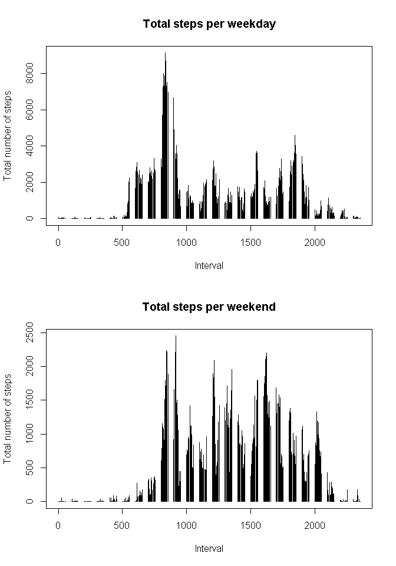

# Reproducible Research: Peer Assessment 1
##Introduction

This assignment makes use of data from a personal activity monitoring device. This device collects data at 5 minute intervals through out the day. 

The data consists of two months of data from an anonymous individual collected during the months of October and November, 2012 and include the number of steps taken in 5 minute intervals each day.

##Data

The data for this assignment can be downloaded from the course web site:
Dataset: Activity monitoring data [52K]

The variables included in this dataset are:

steps: Number of steps taking in a 5-minute interval (missing values are coded as NA)
date: The date on which the measurement was taken in YYYY-MM-DD format
interval: Identifier for the 5-minute interval in which measurement was taken

## Loading and preprocessing the data

```r
      setwd("C:/Users/luiz pellegrini/Documents")
      activity_file <- read.csv("activity.csv", header=TRUE, sep=",", 
         na.strings="NA")
## Eliminates the NA 
      act_file_clean <- na.omit(activity_file)
## summarize total number os steps per day
      sum_file <- as.data.frame(xtabs(act_file_clean$steps ~ 
          act_file_clean$date))
## creates the histogram for the total number os steps per day
      plot(sum_file$act_file_clean.date, sum_file$Freq, 
          type="h", main="Total steps per day", xlab="Date", 
          ylab="Number of steps")
```

 

## What is mean total number of steps taken per day?

The summary file is good to provide a basic overview of this file, showing:
. minimum value,
. maximum value,
. 1st quartile,
. 3st quartile,
. mean, and
. average


```r
      summary(sum_file)
```

```
##  act_file_clean.date      Freq      
##  2012-10-01: 1       Min.   :    0  
##  2012-10-02: 1       1st Qu.: 6778  
##  2012-10-03: 1       Median :10395  
##  2012-10-04: 1       Mean   : 9354  
##  2012-10-05: 1       3rd Qu.:12811  
##  2012-10-06: 1       Max.   :21194  
##  (Other)   :55
```

The mean and the median of steps per day does not include any NA value on steps. In a later part of this of this course project we will calculate a new mean replacing all NA values on steps, and after that the mean and median will be compared with this part.


```r
      library(doBy)
```

```
## Loading required package: survival
```

```r
      mean(sum_file$Freq)
      median(sum_file$Freq)
## Function summaryBy from doBy library groups steps by date and additionally
## calculates the statistical functions like mean and median for each day      
      sum_mean_median <- summaryBy(act_file_clean$steps ~ 
      act_file_clean$date, data=act_file_clean,FUN = list(mean, median))
      names(sum_mean_median) <- c("Date", "Mean", "Median")
```
####The mean is 9354.2295082 and median is 10395
## What is the average daily activity pattern?

####Here is the table with mean and median per each day.

```r
      sum_mean_median 
```

```
##          Date       Mean Median
## 1  2012-10-02  0.4375000      0
## 2  2012-10-03 39.4166667      0
## 3  2012-10-04 42.0694444      0
## 4  2012-10-05 46.1597222      0
## 5  2012-10-06 53.5416667      0
## 6  2012-10-07 38.2465278      0
## 7  2012-10-09 44.4826389      0
## 8  2012-10-10 34.3750000      0
## 9  2012-10-11 35.7777778      0
## 10 2012-10-12 60.3541667      0
## 11 2012-10-13 43.1458333      0
## 12 2012-10-14 52.4236111      0
## 13 2012-10-15 35.2048611      0
## 14 2012-10-16 52.3750000      0
## 15 2012-10-17 46.7083333      0
## 16 2012-10-18 34.9166667      0
## 17 2012-10-19 41.0729167      0
## 18 2012-10-20 36.0937500      0
## 19 2012-10-21 30.6284722      0
## 20 2012-10-22 46.7361111      0
## 21 2012-10-23 30.9652778      0
## 22 2012-10-24 29.0104167      0
## 23 2012-10-25  8.6527778      0
## 24 2012-10-26 23.5347222      0
## 25 2012-10-27 35.1354167      0
## 26 2012-10-28 39.7847222      0
## 27 2012-10-29 17.4236111      0
## 28 2012-10-30 34.0937500      0
## 29 2012-10-31 53.5208333      0
## 30 2012-11-02 36.8055556      0
## 31 2012-11-03 36.7048611      0
## 32 2012-11-05 36.2465278      0
## 33 2012-11-06 28.9375000      0
## 34 2012-11-07 44.7326389      0
## 35 2012-11-08 11.1770833      0
## 36 2012-11-11 43.7777778      0
## 37 2012-11-12 37.3784722      0
## 38 2012-11-13 25.4722222      0
## 39 2012-11-15  0.1423611      0
## 40 2012-11-16 18.8923611      0
## 41 2012-11-17 49.7881944      0
## 42 2012-11-18 52.4652778      0
## 43 2012-11-19 30.6979167      0
## 44 2012-11-20 15.5277778      0
## 45 2012-11-21 44.3993056      0
## 46 2012-11-22 70.9270833      0
## 47 2012-11-23 73.5902778      0
## 48 2012-11-24 50.2708333      0
## 49 2012-11-25 41.0902778      0
## 50 2012-11-26 38.7569444      0
## 51 2012-11-27 47.3819444      0
## 52 2012-11-28 35.3576389      0
## 53 2012-11-29 24.4687500      0
```

To determine the average daily activity pattern is necessary to create a new dataset aggregating information of total number of steps by interval.

Probably there are several ways to achieve the same goal using different commands and functions in R, and I chose this command, because it seemed very simple to use.


```r
## Aggregate number os steps by interval
      sum_file2 <- as.data.frame(xtabs(act_file_clean$steps 
          ~ act_file_clean$interval))
## Creates plot with Number os steps per interval
      plot(sum_file2$act_file_clean.interval, sum_file2$Freq, type="1", 
           xlab="Intervals",ylab="Total number of steps",
           main="Total number os steps per interval"
      )      
```

 

## Imputing missing values

Note that there are a number of days/intervals where there are missing values (coded as NA). The presence of missing days may introduce bias into some calculations or summaries of the data.


```r
      sum(is.na(activity_file$steps))      
```

####There are 2304 missing values in the dataset (i.e. the total number of rows with NAs)


Initially I used a strategy of imputing the total average of steps to replace the NA values. The result was not good enough, because due to the huge amount of the NA the new average was very far from the general average, which was still very biased.

After that I created a table with the daily average and attributed this average to all NA values on that given day. This new strategy proved to be much better and the new average was very close to the general one.

Create a new dataset that is equal to the original dataset but with the missing data filled in.


```r
## fill in average day for NA intervals
      act_file_NA <- activity_file 
      act_file_NA$date <- as.Date(act_file_NA$date)       
      agr_day <- aggregate(act_file_NA$step, list(act_file_NA$date), mean)
      agr_day$Group.1 <- as.Date(agr_day$Group.1)
      agr_day$x[is.na(agr_day$x)] <- 0

## calculate the general mean
## apply the general mean to NA values
      for(i in 1:17568) {
        dif_days <- act_file_NA$date[i+1] - act_file_NA$date[1] + 1
        dif_days <- as.numeric(dif_days)
        act_file_NA$steps[i][is.na(act_file_NA$steps[i])] <- agr_day$x[dif_days]
      }
## creates new file with the replaced NA
      sum_file_WONA <- 
        as.data.frame(xtabs(act_file_NA$steps ~ act_file_NA$date)) 
```

Make a histogram of the total number of steps taken each day and Calculate and report the mean and median total number of steps taken per day. 

Do these values differ from the estimates from the first part of the assignment? What is the impact of imputing missing data on the estimates of the total daily number of steps?


```r
      plot(sum_file_WONA$act_file_NA.date, sum_file_WONA$Freq, 
          type="h", main="Total steps per day", xlab="Date", 
          ylab="Total number of steps")
```

 

```r
      summary(sum_file_WONA) 
```

```
##    act_file_NA.date      Freq      
##  2012-10-01: 1      Min.   :    0  
##  2012-10-02: 1      1st Qu.: 6778  
##  2012-10-03: 1      Median :10395  
##  2012-10-04: 1      Mean   : 9357  
##  2012-10-05: 1      3rd Qu.:12811  
##  2012-10-06: 1      Max.   :21194  
##  (Other)   :55
```

Below are the new mean, median and summary information for the file with NA´s replaced by the daily average.

It is possible to see that the median remains the same and the mean now is very close to the previous one. This happens because we used the daily pattern to fill in the missing values and this provides a very small distortion.


```r
      summary(sum_file_WONA) 
      mean(sum_file_WONA$Freq)
      median(sum_file_WONA$Freq)
```
####The new mean is 9356.8834813 and the new median is 1.0395\times 10^{4}

Here are the differences between mean and medians considering the replacement of NA´s by the daily average


```r
      mean_diff <- mean(sum_file_WONA$Freq) - mean(sum_file$Freq)
      median_diff <- median(sum_file_WONA$Freq) - median(sum_file$Freq)
```
####Mean difference is 2.6539731 and the median difference is 0


## Are there differences in activity patterns between weekdays and weekends?


```r
## This step creates a new dataset with the steps aggregated by interval and date
      sum_day_interval <- aggregate(act_file_clean$steps~
        act_file_clean$interval+act_file_clean$date, FUN=mean)
## This step includes a new column on this dataset to determine if the date is
## a weekday or a weekend      
      sum_day_interval["weekend"] <- NA
      sum_day_interval$`act_file_clean$date` <- 
        as.Date(sum_day_interval$`act_file_clean$date`)
## Chron library has functions fo determine if a given date is a weekend and
## returns a bolean result, TRUE if the is a weekend and FALSE the other days
      sum_day_interval$weekend = 
        chron::is.weekend(sum_day_interval$`act_file_clean$date`)
## This step creates a new file aggregatin steps by interval and weekday fields
      agreg_weekday <- aggregate(sum_day_interval$`act_file_clean$steps`~
        sum_day_interval$weekend + 
        sum_day_interval$`act_file_clean$interval`, FUN=sum)
## colums names are getting too strong, so I renamed them to keep if simple
      names(agreg_weekday) <- c("weekend", "interval", "steps")
## This sepd generates 2 datasets, one for weekday activity and the other for 
## weekend activity
      dt_weekend <- subset(agreg_weekday, agreg_weekday$weekend=="TRUE") 
      dt_weekday <- subset(agreg_weekday, agreg_weekday$weekend=="FALSE") 
## Par command defines two plots in the same column
      par(mfrow=c(2,1))
      plot.ts(dt_weekday$interval, dt_weekday$steps, type="h",
        main="Total steps per weekday", 
        xlab="Interval",ylab="Total number of steps")
      plot.ts(dt_weekend$interval, dt_weekend$steps, 
        type="h", main="Total steps per weekend", 
        xlab="Interval",ylab="Total number of steps")
```

 
.

```r
      x <- max(dt_weekend$steps)
      y <- max(dt_weekday$steps)
      xx <- mean(dt_weekend$steps)
      yy <- mean(dt_weekday$steps)
```
###Comparison of maximum number os steps from weekend against weekdays

#####The maximum number os steps during weekdays is much higher than the number of steps during the weekend. Here is the maximum number of steps during weekdays 9130 compared to the maximum number of steps during weekend 2450
#####The other importart element for comparison among activity behavior during weekdays and weekends is the steps mean in these days. Here is the mean for weekdays 1378.1805556 which is much higher than the mean for weekends, which is 603.0972222
